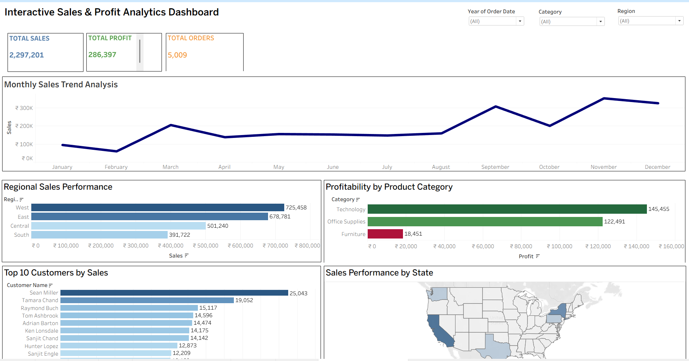

# 📈 Interactive Sales & Profit Analytics Dashboard | Tableau

An interactive Tableau dashboard designed to analyze sales performance, profitability, and business trends. The dashboard provides actionable insights through visual analytics, KPI tracking, and interactive filtering to support data-driven decision-making.

## 🚀 Project Objectives

* Analyze overall sales and profit performance
* Monitor business trends and key metrics
* Identify high-performing products and categories
* Support business decision-making through visual analytics
* Create interactive dashboards for data exploration

## ✨ Key Features

### 📊 Sales Performance Analysis

* Revenue Tracking
* Sales Trend Analysis
* KPI Monitoring

### 💰 Profit Analytics

* Profit Performance Tracking
* Profitability Analysis
* Business Growth Insights

### 🎛️ Interactive Dashboard

* Dynamic Filters
* Interactive Visualizations
* User-Friendly Navigation
* Business KPI Reporting

## 🛠 Tools & Technologies

* Tableau
* Excel

## 📊 Skills Demonstrated

* Data Visualization
* Dashboard Design
* KPI Reporting
* Business Analysis
* Interactive Dashboards
* Data Storytelling
* Analytical Thinking

## 📷 Dashboard Preview

### 📊 Dashboard Overview

## 💡 Business Insights

* Analyzed sales and profit performance across business segments
* Identified trends and opportunities for business growth
* Developed interactive visualizations for decision-making
* Created KPI-driven dashboards for performance monitoring

## 📁 Files Included

* Sales Dashboard.twbx
* Dataset.xlsx
* screenshots/

